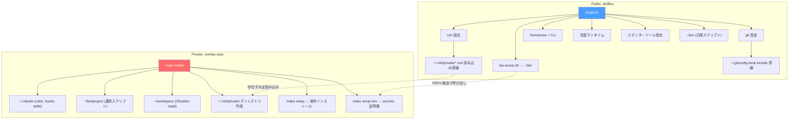

# dotfiles

macOS 環境のセットアップを自動化する Public dotfiles リポジトリ。

## クイックスタート

```bash
# 1. dotfiles（公開基盤）
ghq get texdeath/dotfiles
cd ~/ghq/github.com/texdeath/dotfiles
./install.sh
```

これだけで公開可能な開発基盤が立ち上がる。社内環境が必要な場合は、さらに Private overlay を重ねる（後述）。

## アーキテクチャ



## install.sh の実行内容

| ステップ | 内容 |
|---------|------|
| 1 | Xcode Command Line Tools |
| 2 | シンボリックリンク（zsh, git, bin, lazygit, bw-secret.sh） |
| 3 | Homebrew + `brew bundle` |
| 4 | 言語ランタイム（mise + Volta + Rust） |
| 5 | Cursor 拡張機能・設定 |
| 6 | アプリ設定（Karabiner, Ghostty, Raycast） |
| 7 | macOS defaults |
| 8 | Automator ワークフロー |
| 9 | 検証 |

## 構成

```
dotfiles/
├── install.sh            # 全体セットアップスクリプト
├── Brewfile              # Homebrew パッケージ一覧
├── .tool-versions        # mise (Go, Python) バージョン定義
├── zsh/
│   ├── zshrc             # → ~/.zshrc（末尾で ~/.zsh/private/*.zsh を読み込み）
│   ├── zshenv            # → ~/.zshenv
│   ├── tools.zsh         # mise, fzf, direnv, zoxide 等
│   ├── plugins.zsh       # zinit + プラグイン
│   ├── completions.zsh   # fzf キーバインド, gcloud completion
│   ├── aliases.zsh       # エイリアス（private 依存は存在チェック付き）
│   ├── functions.zsh     # ghq, git fzf 関数
│   └── prompt.zsh        # プロンプト設定
├── git/
│   ├── gitconfig         # → ~/.gitconfig（~/.gitconfig.local を include）
│   └── gitignore_global  # → ~/.gitignore_global
├── bin/
│   ├── fileops/          # → ~/bin/fileops（スクリーンショット・ダウンロード整理）
│   ├── editor/           # → ~/bin/editor（diff ビュー操作）
│   ├── notion/           # → ~/bin/notion（Markdown → Notion 変換）
│   └── claude/           # → ~/bin/claude（メトリクス）
├── secrets/
│   ├── bw-secret.sh      # → ~/bin/bw-secret.sh（Bitwarden CLI ヘルパー）
│   └── registry.tsv      # 汎用シークレット登録簿（gitignore）
├── cursor/               # Cursor 拡張機能・設定
├── karabiner/            # Karabiner Elements 設定
├── ghostty/              # Ghostty ターミナル設定
├── lazygit/              # lazygit 設定
├── macos/                # macOS defaults
├── automator/            # Automator ワークフロー
└── docs/
    └── public-private-integration-design.md
```

## Private overlay との統合

このリポジトリは **Public Base / Private Overlay** アーキテクチャの Base 層として設計されている。

- **dotfiles 単体**で完結する公開可能な開発基盤
- **Private overlay** を重ねると社内環境が完成する
- 拡張ポイント: `~/.zsh/private/*.zsh` / `~/.gitconfig.local`
- 詳細: [Public / Private リポジトリ統合設計](docs/public-private-integration-design.md)

## 更新方法

### Brewfile

```bash
brew bundle dump --file=Brewfile --force
```

### Cursor 拡張機能

```bash
cursor --list-extensions > cursor/extensions.txt
```

### zsh

シンボリックリンクなので、ファイルを編集すれば即反映される。
