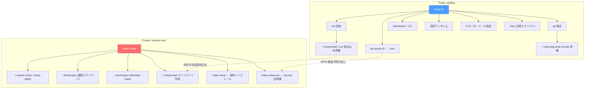

# dotfiles

macOS 環境のセットアップを自動化する Public dotfiles リポジトリ。

## クイックスタート

```bash
# 1. dotfiles（公開基盤）
ghq get texdeath/dotfiles
cd ~/ghq/github.com/texdeath/dotfiles
./install.sh
```

これだけで公開可能な開発基盤が立ち上がる。社内環境が必要な場合は、さらに Private overlay を重ねる（後述）。

## アーキテクチャ



## install.sh のオプション

| フラグ | 内容 |
|-------|------|
| （なし） | 全ステップを実行 |
| `--dry-run` | ソースファイルの存在チェックのみ（実際の変更なし） |

## install.sh の実行内容

| ステップ | 内容 |
|---------|------|
| 1 | Xcode Command Line Tools |
| 2 | シンボリックリンク（zsh, git, bin, lazygit, tmux, bw-secret.sh） |
| 3 | Homebrew + `brew bundle` |
| 4 | 言語ランタイム（mise + Rust） |
| 5 | Cursor 拡張機能・設定 |
| 6 | アプリ設定（Karabiner, Ghostty, Raycast） |
| 7 | macOS defaults |
| 8 | Automator ワークフロー |
| 9 | 検証 |

## 設定適用方式

| 対象 | 方式 | 再実行時の挙動 | ユーザー編集 |
|------|------|--------------|------------|
| zsh (zshrc, modules) | symlink | 上書き（冪等） | リンク先を編集 → 即反映 |
| git (gitconfig, gitignore) | symlink | 上書き（冪等） | リンク先を編集 → 即反映 |
| bin/ (fileops, editor, notion, claude) | symlink | 上書き（冪等） | リンク先を編集 → 即反映 |
| bw-secret.sh | symlink | 上書き（冪等） | リンク先を編集 → 即反映 |
| .tool-versions | symlink | 上書き（冪等） | リンク先を編集 → 即反映 |
| lazygit | symlink | 上書き（冪等） | リンク先を編集 → 即反映 |
| tmux | symlink | 上書き（冪等） | リンク先を編集 → 即反映 |
| Ghostty | symlink | 上書き（冪等） | リンク先を編集 → 即反映 |
| Karabiner | copy | 上書き（ローカル変更は消える） | ローカルで編集後、リポジトリに戻す |
| Automator | copy | 上書き（ローカル変更は消える） | ローカルで編集後、リポジトリに戻す |
| Raycast | manual import | 手動（自動適用なし） | Raycast UI で設定 |
| Homebrew | brew bundle | 追加のみ（既存パッケージは消えない） | `brew bundle dump` で同期 |
| 言語ランタイム | mise / rustup | バージョン更新 | .tool-versions を編集 |
| Cursor | cursor CLI | 拡張追加 + 設定上書き | Cursor UI で設定 |
| macOS defaults | defaults write | 上書き | システム環境設定で変更可（再実行で戻る） |

## 構成

```
dotfiles/
├── install.sh            # オーケストレーター（steps/ を順に実行）
├── steps/                # 各ステップの実装（10-xcode 〜 90-verify）
│   └── lib.sh            # 共通ヘルパー関数
├── Brewfile              # Homebrew パッケージ一覧
├── .tool-versions        # mise (Go, Python) バージョン定義
├── zsh/
│   ├── zshrc             # → ~/.zshrc（末尾で ~/.zsh/private/*.zsh を読み込み）
│   ├── zshenv            # → ~/.zshenv
│   ├── tools.zsh         # mise, fzf, direnv, zoxide 等
│   ├── plugins.zsh       # zinit + プラグイン
│   ├── completions.zsh   # fzf キーバインド, gcloud completion
│   ├── aliases.zsh       # エイリアス（private 依存は存在チェック付き）
│   ├── functions.zsh     # ghq, git fzf 関数
│   └── prompt.zsh        # プロンプト設定
├── git/
│   ├── gitconfig         # → ~/.gitconfig（~/.gitconfig.local を include）
│   └── gitignore_global  # → ~/.gitignore_global
├── bin/
│   ├── fileops/          # → ~/bin/fileops（スクリーンショット・ダウンロード整理）
│   ├── editor/           # → ~/bin/editor（diff ビュー操作）
│   ├── notion/           # → ~/bin/notion（Markdown → Notion 変換）
│   └── claude/           # → ~/bin/claude（メトリクス）
├── VERSION               # semver バージョン（private overlay のバージョンチェック用）
├── secrets/
│   ├── bw-secret.sh      # → ~/bin/bw-secret.sh（Bitwarden CLI ヘルパー、REGISTRY_PRIVATE 対応）
│   └── registry.tsv      # 汎用シークレット登録簿（gitignore）
├── cursor/               # Cursor 拡張機能・設定
├── karabiner/            # Karabiner Elements 設定
├── ghostty/              # Ghostty ターミナル設定
├── lazygit/              # lazygit 設定
├── tmux/                 # tmux 設定
├── macos/                # macOS defaults
├── automator/            # Automator ワークフロー
├── .github/workflows/    # CI（dry-run + public 境界チェック）
└── docs/
    └── public-private-integration-design.md
```

## orch-runtime workspace watch 通知

`orch-runtime workspace watch <workspace>` は runtime signal が変化したときに標準出力へ summary を出し、必要に応じて外部通知も送る。初回 snapshot は通知せず、前回 snapshot から `alert` / `stale` / `unknown` などへ変化した signal だけを通知する。

現在の pane 状態を一度だけ通知したい場合は `orch-runtime notify claude` や `orch-runtime notify %1` を使う。

| 設定 | 内容 |
|------|------|
| `--no-notify` | 通知を無効化し、標準出力と `--log-file` のみ使う |
| `--notify-statuses alert,stale,unknown` | 通知対象 status を指定 |
| `ORCH_RUNTIME_WORKSPACE_WATCH_NOTIFY_COMMAND` | 任意の通知コマンドを `<title> <message>` で呼び出す |
| `ORCH_RUNTIME_WORKSPACE_WATCH_WEBHOOK_URL` | Slack 互換 incoming webhook に `{"text": ...}` を POST する |
| `ORCH_RUNTIME_WORKSPACE_WATCH_NOTIFY_TIMEOUT` | 通知コマンド / webhook の timeout 秒数 |

通知先が未設定、または `curl` / 通知コマンドが存在しない場合は何も送らず継続する。macOS では `terminal-notifier` を優先し、なければ `osascript` が使える場合だけローカル通知を併用する。Webhook URL や通知先の認証情報はリポジトリに置かず、ローカルのシェル設定や環境変数から渡す。

## CI

Push / PR で以下を自動検証:

- **dry-run**: `install.sh --dry-run` でソースファイルの存在チェック
- **boundary-check**: 社内キーワードとハードコードされた絶対パスの混入検出

## Private overlay との統合

このリポジトリは **Public Base / Private Overlay** アーキテクチャの Base 層として設計されている。

- **dotfiles 単体**で完結する公開可能な開発基盤
- **Private overlay** を重ねると社内環境が完成する
- 拡張ポイント: `~/.zsh/private/*.zsh` / `~/.gitconfig.local`
- 詳細: [Public / Private リポジトリ統合設計](docs/public-private-integration-design.md)

## 更新方法

### Brewfile

```bash
brew bundle dump --file=Brewfile --force
```

### Cursor 拡張機能

```bash
cursor --list-extensions > cursor/extensions.txt
```

### zsh

シンボリックリンクなので、ファイルを編集すれば即反映される。
